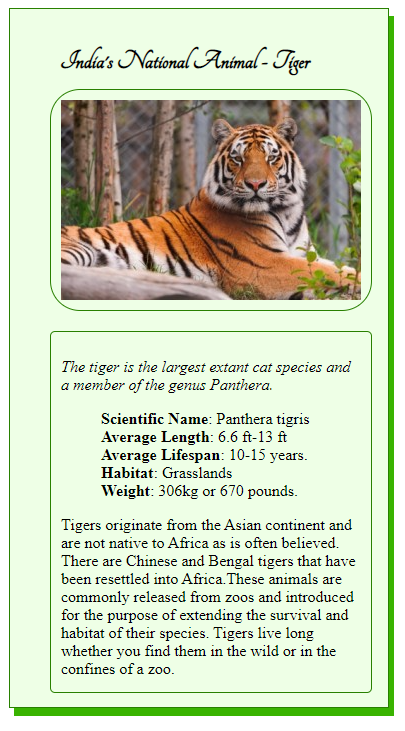

# Description

* Developed an animal trading card using CSS and HTML. 
* Card contains the name of an animal, picture of that animal and other information of animal which includes interesting facts and general information. 

# Technologies Used

* HTML
* CSS

# Running the app 

1. Clone or download files to your machine. 
2. Create a folder and place all these files in that folder. 
3. Click on the "card.html" file.

# Screen Captures

* Following is screen capture of card.

